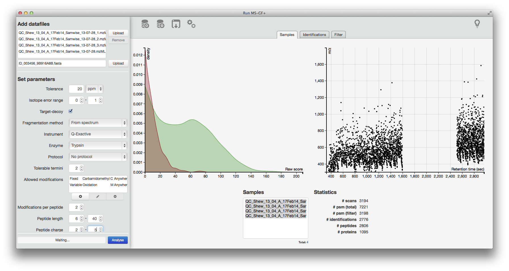
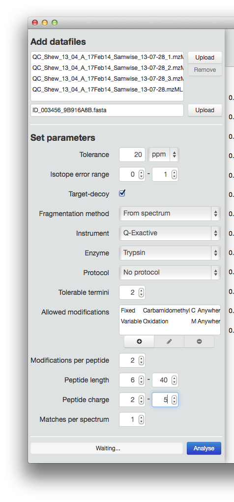
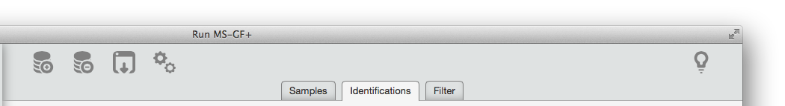
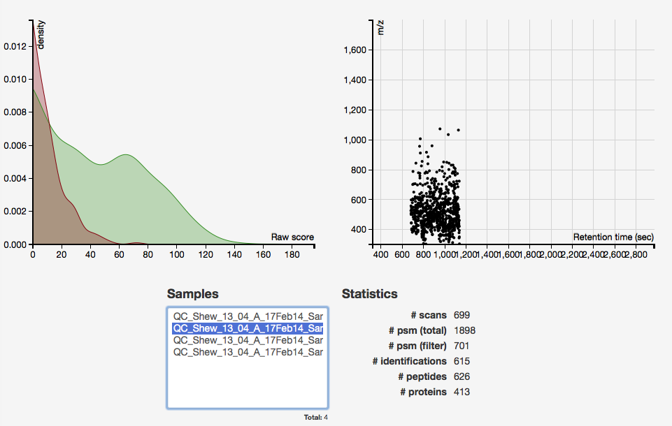
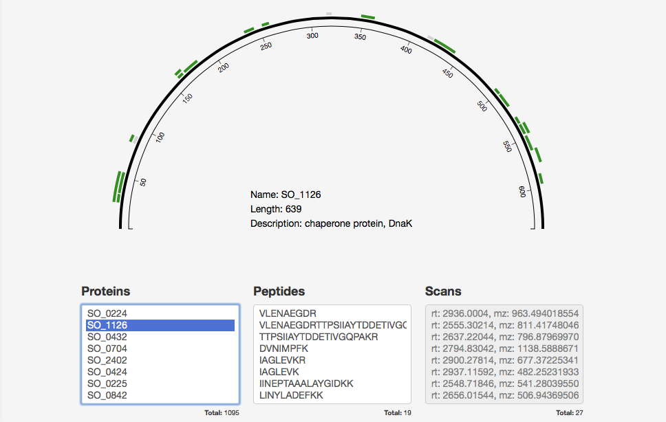

*  *  *
```{r, echo=FALSE, results='hide', message=FALSE}
library(MSGFgui)
```

This document is intended to guide the user through the different aspects of
using MSGFgui to perform peptide identification from raw LC-MS/MS data and
inveestigate the results. Note that this document will not describe the inner
workings of MS-GF+ - the algorithm that performs the identification. For users
interested in the nitty-gritty of the algorithm please see the 
[MS-GF+ webpage](http://proteomics.ucsd.edu/software-tools/ms-gf/).

This package comes with a sister package, 
[MSGFplus](https://github.com/thomasp85/MSGFplus), that provides the interface
to the original MS-GF+ java code. If you wish to implement MS-GF+ analysis
within your own functions or packages, MSGFplus provide a command-line interface
to MS-GF+. This package, conversely, only provides a GUI overlay and a symphony
of visualisations coded in Javascript (using D3.js) that cannot be accessed 
through R code.

MSGFgui is being maintained at its 
[GitHub repository](https://github.com/thomasp85/MSGFgui), where bug reports and
feature requests are happily accepted.

## System requirements
Well obviously you need R, but lets assume you got that covered. The main point
is that working with proteomics data puts some strain on your system. I don't 
want to throw you a list of specs you should compare your system to, but do know
that the kind of analysis facilitated by the GUI is best suited for a 
workstation class system. That means lots of memory and a multitude of cores.
When that is said there is nothing about the GUI itself that requires a 
mighty machine, so if you have some small (~200 mb) raw files you'll have no 
problem playing around with the GUI on a decent laptop.

**WARNING:** Due to some unfortunate incompatibility between shiny, mzR/Rcpp and
RStudio, running MSGFgui through RStudio will cause the R session to crash once
raw data is trying to get accessed (retrieving raw MS/MS scans). This is not a 
problem when running R in the standard way. This problem will hopefully soon be
adressed and this warning will disappear.

## Opening the GUI
As this package is all about a graphic user interface, it exposes very few 
functions to the user (only 2). The one that you will probably use most often is
`MSGFgui()` (the other one will be discussed in a bit). In all its simplicity
the GUI is started from the R terminal as such:

```{r, eval=FALSE}
# Standard fashion
MSGFgui()

# You can pass parameters along to shiny's runApp()
MSGFgui(port='0.0.0.0')
```

This will open up MSGFgui in your standard browser. Once the GUI is running the 
R process is interupted. To regain control of R (and shut down MSGFgui) press 
the 'esc' key.

## Overview of the GUI
Once the GUI has opened you will be greated by an interface split in two: The 
left side aids you in selecting data files and setting the parameters for an 
MS-GF+ analysis. The right side lets you explore the results of the analysis
as well as export it to different formats.



It should be noted that it is not necessary to use the GUI for running MS-GF+ in
order to be able to use the exploratory features of the GUI. Result files 
generated using MSGFplus or barebone MS-GF+ can be imported, provided the raw
data file is still present alongside the result file. This makes it able to 
reimport older analysis for comparing etc. Do note that the GUI only support
results from MS-GF+ and not other peptide identification software, no matter
which output format they support. Trying to import other result files will not
crash the GUI but be met with an alert during import.

### Running MS-GF+ from the GUI



MSGFgui makes it easy for people uncomfortable with command line interfaces to
run MS-GF+ analyses. The benfits for other include easy batch-job creation and 
instant parameter documentation lookup. Everything related to running MS-GF+ is
located on the left hand side, and split into file selection and parameter
setup.

***File selection***

In order to run an analysis, two types of files are needed. The obvious one is
raw LC-MS/MS data files. MS'GF+ supports most open MS data file formats but 
encourages the use of mzML. mzML files can be created from proprietary vendor
formats using [msconvert](http://proteowizard.sourceforge.net). 

To add a raw
data file simple click on the topmost 'Upload' button and navigate to the file.
Batchjobs are created simply by selection multiple files. In addition a fasta 
file containing the proteins expected to be in your samples is needed. This is
selected by clicking the bottommost 'Upload' button. Note that the fasta file
should only contain the expected proteins. MS-GF+ creates its own decoy database
from this file.

***Parameters***

Below the file selection area is a list of all parameters that can be set, in 
order to fine tune the analysis. A full description of all parameters is
available in the [MS-GF+ documentation](https://bix-lab.ucsd.edu/pages/viewpage.action?pageId=13533355)
but more or less the same information is also available as tooltips when the
user hover over the name of the parameter.

There is automatic checking of the parameters, meaning that it should be 
virtually imposible to supply erroneous parameters to the analysis. The Analyse
button is simply not active if the parameters don't conform, and the violating
values will be marked with a red border.

The parameters have a huge influence on the quality of the analysis, so don't
fill them in blindly. Unless you are continuously analysing samples from the 
same setup, try to experiment with different sensible values until you have
reached the optimal setup

***Running***

Once everything is filled out to your liking it is time to start the analysis.
This is done by clicking the aptly named 'Analyse' button in the lower right 
corner of the pane. If the button is not clickable it means you have not 
supplied the parameters in the right format (see above) so revisit those and fix
the errors. Once the analysis is running a progress bar will inform you about 
how things are proceeding. Results are imported as they are available, but you
will experience lag in some operations if you try to interact with the results
before the full batch is done.

### Investigating the results
Once raw data have been analysed or old results imported it is time to 
investigate them. MSGFgui tries to distance itself from the usual "provide a
table with results and some plots upon double clicking rows", and tries to
implement a more fluid and natural interaction with the identification data.

#### Navigating the result pane



In the top of the result pane there is a collection of icons providing a toolbar
like functionality. From left to right, these are: *Import results*, *Remove 
results*, *Export results*, *Settings* and *About MSGFgui*. Tooltips describing
each of them is available upon hovering, but their functionality is pretty 
self-describing. Exporting can be done in either RDS, xlsx or txt format. Below 
the toolbar is a tabpane that lets the user select one ofthree tabs. Each of 
these will be described in the following.

#### The samples
The first pane, and the one visible at startup, concerns itself with 
communicating the overall results in a concise way. It contains information such
as: number of samples, number of scans, number of identified peptides and 
proteins etc. as well as overall quality statistics.



The main part of the pane is allocated to two plots. One plot shows the 
distrubution of score values for peptide-spectrum matches (psm), divided between
real (green) and decoy (red) hits. The other plot shows the placement of parent 
ions from accepted psm's in a scatter plot. Both of these plots respond to 
sample selection in the list below them. If multiple samples are selected the
plots will shows the union of the selected samples. Beside the sample selection
is a list of numeric statistics pertaining to the current selection. The 
different statistics are rather self-explanatory, but it should be noted that
with the exception of *psm*, all numbers are for the filtered data (see the
discussion of the filter pane below). For psm both filtered and unfiltered
numbers are given.

#### The identifications
The second pane is all about investigating the nature of the identification. It
is organised in a protein centric way from the belief that most users will 
primarily be interested in the data in a top-down manner (from protein to 
peptide to scan).

***Proteins***



Selecting a protein from the leftmost list will result in a visualisation of the
protein swooshing in from the left. The visualisation shows the full length of 
the protein with identified peptides shown above it according to their position
on the protein. Peptide identification that pass the current filter are shown in
green while those that don't are shown in grey. In the centre of the
visualisation general information about the protein is shown. This information
relies upon a properly annotated database file used during analysis.

***Peptides***


In the centre list all peptides for the selected protein passing the filter is 
shown. Selecting one will highlight the selected peptide in the visualisation
and dim the rest. Furthermore the protein information in the middle of the
visualisation is substituted for a representation of the residues making up the
peptide sequence. The flanking residues are shown in grey and modification are
shown at their corresponding residues if any is present in the peptide.

***Scans***


In the rightmost list all scans resulting in a match to the selected peptide and
which passes the filter is shown. Clicking on one of them will move the protein
arc out of the way to give room for an annotated spectrum plot. Fragment ions
will be shown in black with the type on top and the parent ion, if observed, in
red. The rest of the ions will be grey. The peptide sequence will still be 
visible but is now overlayed with the observed fragmentation points, as well as 
which types of ions support the specific fragmentation. Lastly a small plot in
the upper right corner shows the peak that the parent ion is part of along with
the position of the parent ion and other sampling points if present.

#### The Filter
The last tab pane contains a wide variety of options for filtering the 
identifications. The filtering options are divided horizontally into options
related to quality, scan information and peptide information.


At the top, the only quality related filtering option is related to setting the
FDR cutoff. By default this is set to 0.01 as that is the de facto standard in 
proteomics. It should be noted that the FDR cutoff is dumb in the sense that it
relies on the q-values calculated by MS-GF+. This means that it does not take
into account any filtering that is happening in the GUI. Following this is a 
range of options for trimming down the scans, either by only looking at specific
samples, retention times, m/z values or charges. At the bottom is the options 
for filtering on peptide information. It is possible to choose only to look at 
peptides related to a subset of proteins or of a certain length, as well as 
having a specific modification. Once a filter is set it is applied the instance 
another tab is selected. If the filter is too tight and no psm's are left it 
will ask you to loosen the filter. It should be noted that the filtering is 
provided with the purpose of making it easier to find the information of 
interest. For instance if one is mostly interested in looking at prtoeins with
detected phosphorylation sites, selecting phosphorylation in the modification
list will mean that only those proteins where phosphorylated peptides have been
identified is visible. On the other hand it is not meant as a way to improve the
quality of the results. If this is the interest the 
[MSnID](https://github.com/vladpetyuk/MSnID) package would be a good starting
point. The latter point also means that the filtering is not applied when 
exporting the results.

## Accessing data directly through another R session
In the beginning I promised another R function, and the time has now come for
that. While the export function makes it possible to reimport the results into
R for further processing, this operation is so common that it has warranted a 
shortcut. While the GUI is running it is possible to start another R session and
access the results currently present in the GUI by using `currentData()`. The 
function returns an mzIDCollection object populated with the results. If no GUI
is open it will return the results of the last session.

```{r}
results <- currentData()

show(results) # Empty as no analysis has been run
```

Do note that there is no direct connection between the GUI and the output from
`currentData()`. This means that if changes happens in the GUI they are not 
automatically reflected in the mzIDCollection (in the above example `results` 
will still be empty after an analysis has completed in the GUI). A new call to
`currentData()` is necessary to bring the two sessions in sync again.

## Whats next?
The GUI was build out of a need for an easy interface to running MS-GF+. During
development it gradually became more about pushing the envelope on how protein
identification is displayed, as well as the richness and polish in R/shiny GUIs.
There is a bunch of things I would like to add both in terms of visualisation 
and under-the-hood functionality. If you have any requests yourself please let 
me know either through the
[GitHub page](https://github.com/thomasp85/MSGFgui/issues) or by email. If 
you're just a happy user who would like to see the software evolve, you're also 
welcome to drop me a line - I'll probably put more attention to it if many 
people are using it.

Following is a roadmap in no particular order:

* Make it work as a frontend to a cluster environment
* Lookup modifications from psi-mod
* Add additional plots to the sample overview
    + m/z deviation plot
    + charge distribution
    + peptides per protein distribution
* Use HTML5 Local storage to remember settings between sessions
* Show modification sites on the protein arc
* Show expected cleavage sites on protein arc
* Add brushing and linking to plots

## Session
```{r, eval=TRUE, echo=TRUE}
sessionInfo()
```
